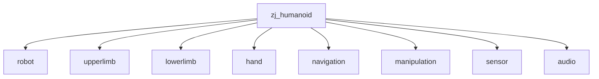

# navi_ros_sdk
浙江人形机器人创新中心推出的领航者2号(Navi02)机器人的ROS1 SDK；主要介绍Navi02 基于ROS1的API接口；

## Project Structure

```
.
├── docs                                            # 相关文档, 这个文件夹会自动生成github page
│   ├── images/                                     # 相关图片
│   ├── zj_humanoid_types.md                        # msg和srv说明文档
│   └── develop_guides.md                           # Navi机器人SDK开发指南
├── api_struct                                      # 相关demo功能包
│   ├── zj_humanoid/                                # ros api的说明和demos的数据，路径表示service或topic name
│   ├── generated/                                  # 根据zj_humanoid_interfaces.yaml生成的及其他格式API说明
│   ├── zj_humanoid_ros_interfaces.md               # ros api的整体集合markdown版本
│   ├── demos_shell_test.sh                         # ros api的测试工具
│   └── zj_humanoid_types_25_R3.run                 # ros数据结构安装包
└── README.md                                       # this file
```

## zj_humanoid/ Sub-package


## Navi Robots SDK Develop Guides
[guides github-pages](https://zj-humanoid.github.io/zj_humanoid_sdk_ros/)
或者 [develop_guides.md](./docs/develop_guides.md)

## How To Use .run
在开发环境中安装zj_humanoid_types_25_R3.run，就可以使用我们机器人api的数据结构了；
数据结构内容，请查阅：[zj_humanoid_types](./docs/zj_humanoid_types.md)

```
Help:
  ./zj_humanoid_types_25_R3.run                      # Install all .deb files in the current directory
  ./zj_humanoid_types_25_R3.run -- --uninstall       # Uninstall all .deb files in the current directory
  ./zj_humanoid_types_25_R3.run -- --version         # Show verison
  ./zj_humanoid_types_25_R3.run -- --changelog       # Show changelog
  ./zj_humanoid_types_25_R3.run -- --help            # Show the help info
```

## navi_ros_sdk APIs

你可以在api_struct/目录下zj_humanoid_interfaces.yaml中找到所有API的定义，针对不同场合我们在generated/文件夹中生成了多种不同格式的API描述文件；

## How To Run Demos

API运行所需的demos的数据（yaml格式）位于api_struct/zj_humanoid/下的各个文件夹下；
用户可以使用ros提供的命令行工具，调用demos的yaml数据，测试机器人的API效果；
参考示例：

### rosservice call
    rosservice call /zj_humanoid/upperlimb/movej/left_arm "$(cat zj_humanoid/upperlimb/movej/left_arm/left_arm_t_case1.yaml)"

### rostopic publish
    rostopic pub /zj_humanoid/upperlimb/servoj/left_arm "$(cat zj_humanoid/upperlimb/servoj/left_arm/left_arm_t_case1.yaml)"
    
### rostopic subscriber
    rosservice echo /zj_humanoid/upperlimb/joint_states

