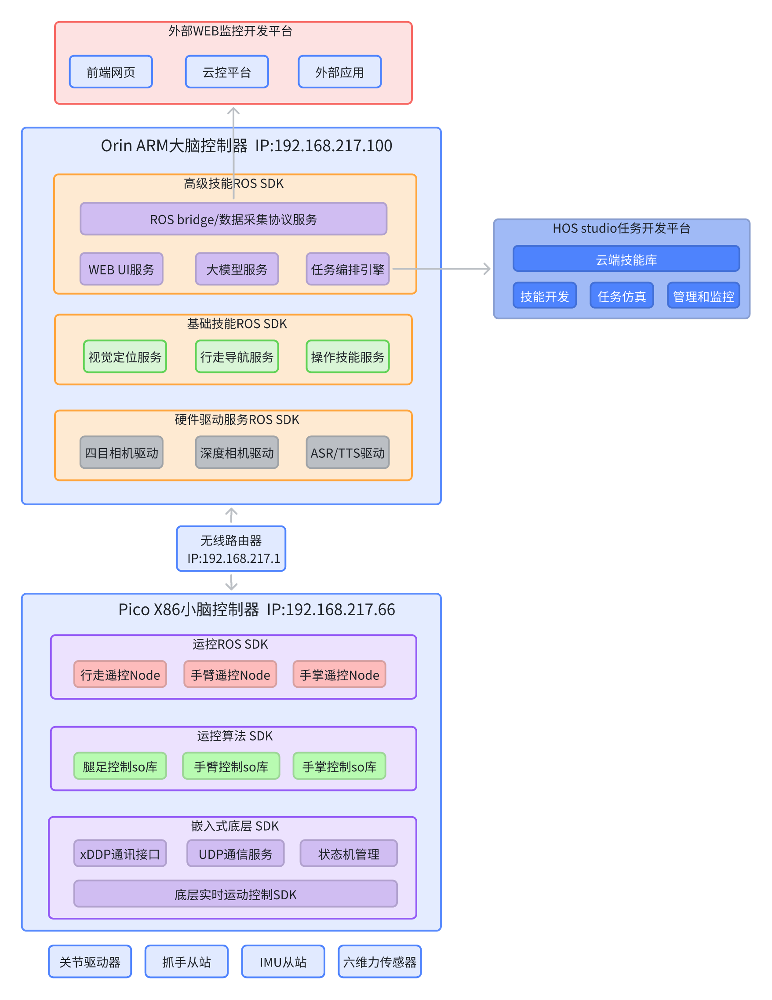
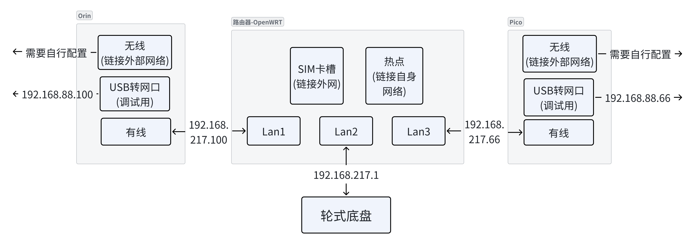

# Navi机器人SDK开发指南

## 概述

### 文档目的
本 SDK 是专为浙江人形机器人创新中心推出的领航者 2 号（Navi02）人形机器人打造的 ROS1（Noetic）适配开发工具包。其核心目标是封装机器人底层接口（关节控制、定位导航、电源管理等），提供标准化的 ROS1 消息接口和工具集，降低开发者的二次开发门槛，支持快速搭建路径规划，手部操作等上层应用，使得机器人可以理解并执行操作者或开发者的指令意图，进而完成更为复杂的工作，和具身智能的使命。

### 机器人SDK包含范围：
#### 机器人应用开发SDK主要包含：
1. 一组基于分布式消息中间件的API集合，我们当前采用的机器人领域采用最广泛的ROS消息中间件与其msg/ srv/等数据结构来描述我们机器人的内在能力；
2. 基于上述接口，提供了基于C++/Python等语言编写的各种demos，给开发者提供编程示例以及说明文档，引导初次接触人形机器人的开发人员；
3. 除了编程语言，我们同时提供了各种界面化的示教器等调试工具，方便客户通过UI完成机器人的较为简单的控制和调试需求；
4. 我们同时提供了机器人的图形化编程界面HOS，简化机器人开发时的环境配置和api调用逻辑，让开发者可以专注于自身的业务与算法开发，加快机器人应用开发和部署的步骤；

#### 机器人SDK层级图：


### 开发环境
- 操作系统：Ubuntu 20.04（ROS Noetic）
- ROS版本：ROS1 Noetic
- 支持语言：Python3.x，C++17及以上
- 硬件兼容：支持领航者 2 号（Navi02）人形机器人，WA1/WA2轮臂机器人，半身机器人
- 适用场景：第三方应用集成，二次开发，机器人导航、操作、行走等功能的快速部署

### 系统框架
机器人采用大脑+小脑的双控制器控制，并提供了多样的开发方式，详见 [终端连接](#终端连接)

#### 机器人内部软件框图


## 快速开始
### 开机
#### 开机键
机器人没有单独的开关机按键，给机器上电后，机器人进入开机状态；
    - 对于双足全身型（i2）的机器人而言，打开机器人背后的电池包上的电源开关即可；
    - 对于半身型机器人（），将底盘引出的插头插入220V电源插板即可；
    - 对于轮臂型机器人（wa1），需要长按轮式底盘上的电源开关；
  
#### 开机状态指示
启动开机流程后，首先机器人内部的控制器将进入系统的boot状态，开始启动大小脑的Linux系统；
机器人开机后，将通过语音和面部显示器指示当前机器人的启动状态；
启动时序如下(以全身型机器人为例)：
    机器人上电后，内部的SDK开始自主bringup，全身关节会处于归位过程，并处于僵直状态，此时机器人无法自主保持站立，因此确保上电后机器人仍处于安全状态；
    小脑SDK启动完成后，需在确保机器人脚掌触地状态下，可通过语音，遥控等方式命令机器人站立后执行后续指令（轮臂款机器人无此限制）；
    SDK启动时序（时间未准确标定）：


### 网络与连接
在新的环境中，初次启动机器人，需要确定机器是否已经联网，在没有联网的状态下，部分机器人的功能将无法使用；
建议使用显示器+键鼠登入到orin进行联网设置；

#### 使用显示器和键鼠
使用USB键鼠和DP线连到机器人orin大脑之后，按照Ubuntu系统的方式使机器人连上用户的wifi， 并将大脑orin 设置为固定IP，避免经常更换；

##### 全身/半身型外设接口


##### 轮臂型外设接口


##### 轮臂型网络拓扑


#### 使用机器人AP热点
对于不方便接USB键鼠和HDMI屏幕的场景，也可以通过连接机器人自身的AP热点来配置机器人的网络；
机器人大脑默认的AP名称前缀为nav01ap的Wi-Fi，此Wi-Fi就是机器人大脑的AP热点，密码为88888888。

#### 终端连接
完成机器人的网络配置之后，对于开发者而言，可能还需要使用终端登入大脑系统，支持如下方式登入：
- Linux系统内终端：如果已经使用USB和HDMI登入orin，可以直接使用Linux系统终端登入；
- 外部终端登入Linux：通过标准ssh协议登入orin Linux系统，ssh端口是22；
- 登入到demos容器：
    - 在Linux终端内，支持使用docker exec -it navi_project-demos-1 bash
    - 外部终端，可通过ssh协议登入demos，指令：ssh root@ip -p 2222，密码：naviai@2025

### 开发
对于开发者，需要机器人完成更复杂任务时，我们提供了ROS开发以及基于ROS API的HOS图形化编程； ROS API列表参考下一章节；

#### 开发环境配置
在[开发环境](#开发环境)中安装<a href="/zj_humanoid_sdk_ros/zj_humanoid_types_25_R3.run" download>zj_humanoid_types_25_R3.run</a>，就可以使用我们机器人api的数据结构了； 数据结构内容，请查阅：[zj_humanoid_types](./zj_humanoid_types)
```
Help:
  ./zj_humanoid_types_25_R3.run                      # Install all .deb files in the current directory
  ./zj_humanoid_types_25_R3.run -- --uninstall       # Uninstall all .deb files in the current directory
  ./zj_humanoid_types_25_R3.run -- --version         # Show verison
  ./zj_humanoid_types_25_R3.run -- --changelog       # Show changelog
  ./zj_humanoid_types_25_R3.run -- --help            # Show the help info
```
#### ROS Python/C++
我们提供了标准的ROS编程环境，帮助开发者快速的启动开发；demos可参考[demos](./demos/Combined_Example)
    
#### HOS开发
我们提供了HOS的图形化编程界面，帮助开发者更便捷的调用机器人的API接口，更便捷调试部署等工具，使得开发者可以专注于自身的逻辑开发；


### 常见问题和解决方法

#### 1. 开机没有语音播报“机器人大脑启动成功”
    该语音指示了机器人与远程服务器的连接状态，如果开机没有播报启动成功，需要确认网络连接状态；

#### 2. 机器人启动后无法调用肢体动作
    需要确认急停按键是否被按下，或者电机是否有损坏；

#### 
