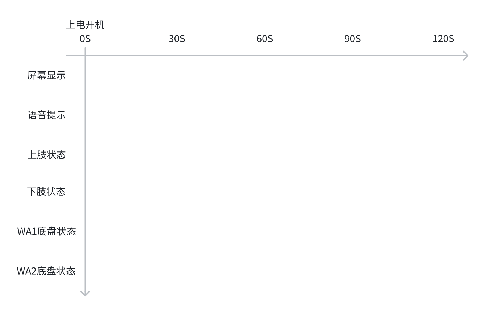
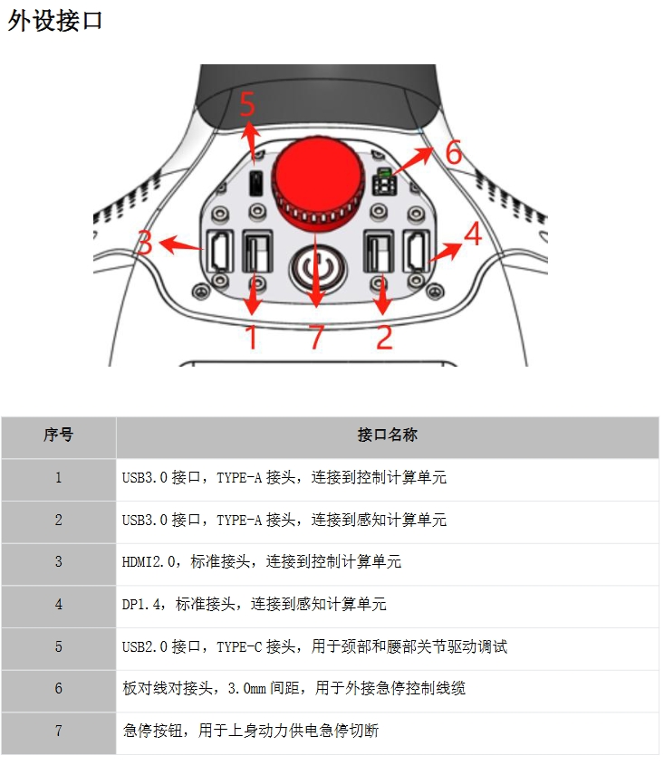
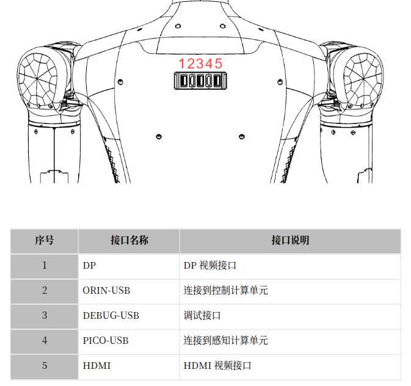

# Navi机器人SDK开发指南

这是浙江人形机器人Navi系列的SDK和编程指引文档站点。

## 快速开始
### 1. 开机
#### 1.1 开机键
    机器人没有单独的开关机按键，给机器上电后，机器人进入开机状态；
      - 对于双足全身型（i2）的机器人而言，打开机器人背后的电池包上的电源开关即可；
      - 对于半身型机器人（），将底盘引出的插头插入220V电源插板即可；
      - 对于轮臂型机器人（wa1），需要长按轮式底盘上的电源开关；
  
#### 1.2 开机状态指示
    启动开机流程后，首先机器人内部的控制器将进入系统的boot状态，开始启动大小脑的Linux系统；
    机器人开机后，将通过语音和面部显示器指示当前机器人的启动状态；
    启动时序如下(以全身型机器人为例)：
      机器人上电后，内部的SDK开始自主bringup，全身关节会处于归位过程，并处于僵直状态，此时机器人无法自主保持站立，因此确保上电后机器人仍处于安全状态；
      小脑SDK启动完成后，需在确保机器人脚掌触地状态下，可通过语音，遥控等方式命令机器人站立后执行后续指令（轮臂款机器人无此限制）；
      SDK启动时序（时间未准确标定）：

### 2. 网络与连接
    在新的环境中，初次启动机器人，需要确定机器是否已经联网，在没有联网的状态下，部分机器人的功能将无法使用；

#### 2.1 使用显示器和键鼠
    使用USB键鼠和HDMI线连到机器人orin大脑之后，按照Ubuntu系统的方式使机器人连上用户的wifi；

##### 全身/半身型外设接口

##### 轮臂型外设接口

#### 2.2 使用机器人AP热点
    对于不方便接USB键鼠和HDMI屏幕的场景，也可以通过连接机器人自身的AP热点来配置机器人的网络；
    机器人大脑默认的AP名称前缀为nav01ap的Wi-Fi，此Wi-Fi就是机器人大脑的AP热点，密码为88888888。

#### 2.3 终端连接
    完成机器人的网络配置之后，对于开发者而言，可能还需要使用终端登入大脑系统，支持如下方式登入：
      - Linux系统内终端：如果已经使用USB和HDMI登入orin，可以直接使用Linux系统终端登入；
      - 外部终端登入Linux：通过标准ssh协议登入orin Linux系统，ssh端口是22；
      - 登入到demos容器：
        - 在Linux终端内，支持使用docker exec -it navi_project-demos-1 bash
        - 外部终端，可通过ssh协议登入demos，指令：ssh root@ip -p 2222，密码：naviai@2025
  
### 3. 开发
    对于开发者，需要机器人完成更复杂任务时，我们提供了ROS开发以及基于ROS API的HOS图形化编程； ROS API列表参考下一章节；
#### 3.1 ROS Python/C++
    我们提供了标准的ROS编程环境，帮助开发者快速的启动开发；
    
#### 3.2 HOS开发
    我们提供了HOS的图形化编程界面，帮助开发者更便捷的调用机器人的API接口，更便捷调试部署等工具，使得开发者可以专注于自身的逻辑开发；
