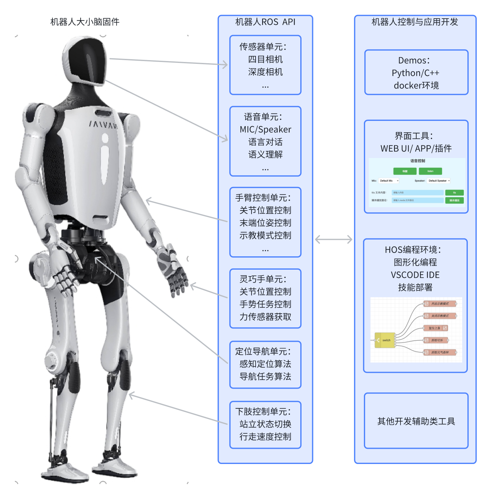
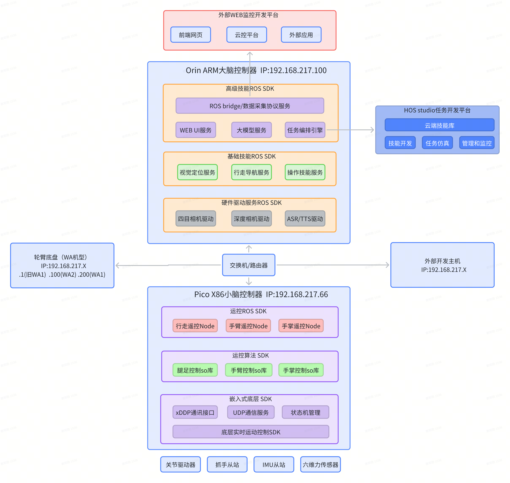
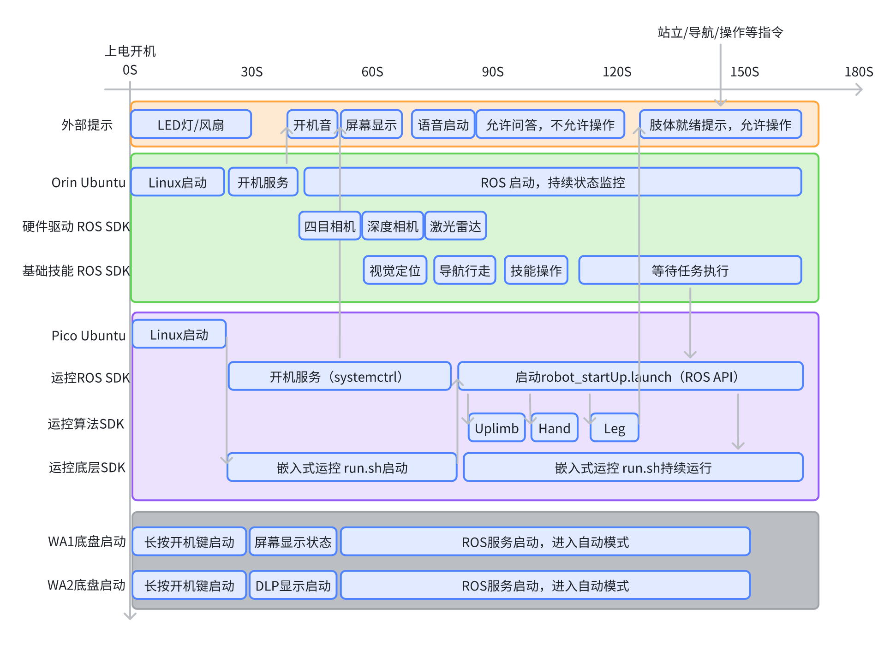
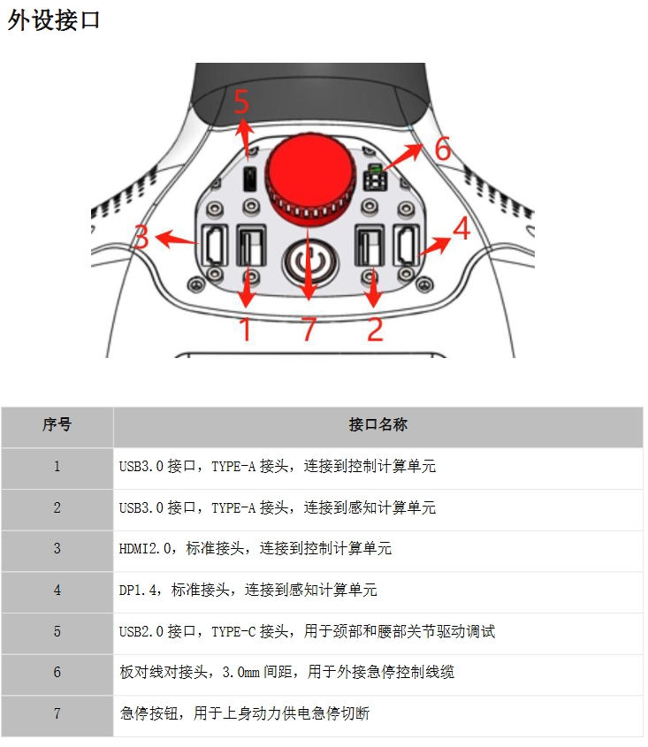
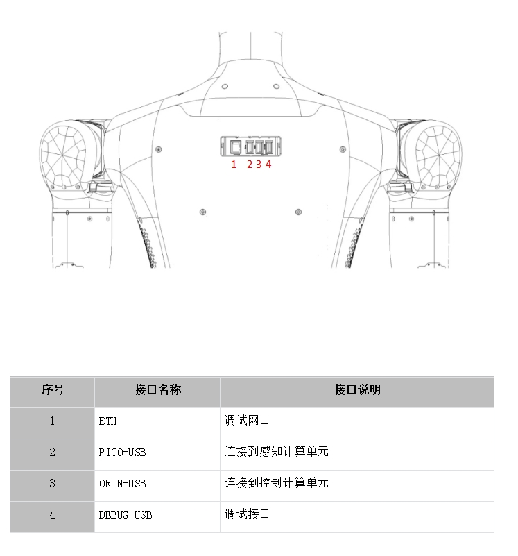
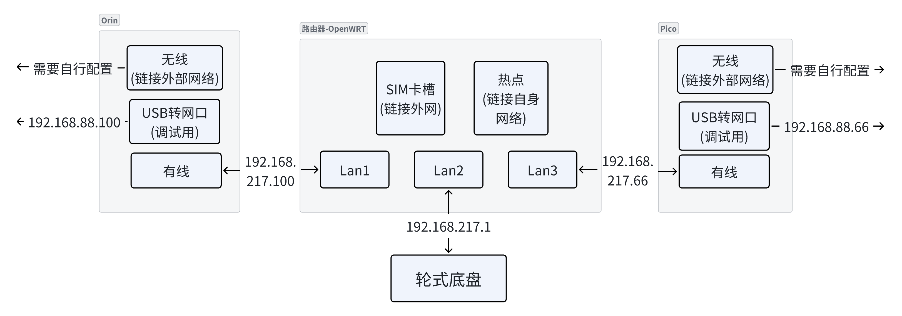

# Navi机器人SDK开发指南 v1.5.0

::: info 当前版本
本文档对应 Middleware v1.5.0，适用于 ROS1 Noetic。
:::

## 📑 文档导航

- [概述](#概述)：SDK 范围与运行环境
- [快速开始](#快速开始)：开机、联网和终端连接
- [ROS API](/api/zj_humanoid_ros_api)：Service、Topic 和 Action 接口
- [版本变更](/release_notes)：v1.3.0 至 v1.5.0 的接口变化
- [Message Type](/markmap_message_type)：自定义 ROS 数据类型
- [开发示例](/demos/Combined_Example.md)：接口调用示例
- [调试开发工具](tools/web_telec)：Web 调试工具
---

## 概述

本 SDK 面向浙江人形机器人 Navi 系列，封装关节控制、定位导航、电源管理等底层能力，并提供统一的 ROS1 接口、示例和调试工具。

SDK 包含：

1. ROS Service、Topic、Action 和配套自定义消息；
2. C++、Python 调用示例；
3. Web 示教与调试工具；
4. HOS 图形化编程环境。

### SDK 层级图


### 开发环境
- 操作系统：Ubuntu 20.04（ROS Noetic）
- ROS 版本：ROS1 Noetic
- 支持语言：Python 3、C++17 及以上
- 硬件兼容：支持领航者 2 号（Navi02）人形机器人，WA1/WA2轮臂机器人，半身机器人
- 适用场景：第三方应用集成，二次开发，机器人导航、操作、行走等功能的快速部署

### 系统框架
机器人采用大脑+小脑的双控制器控制，并提供了多样的开发方式，详见 [终端连接](#终端连接)

#### 机器人内部软件框图


## 快速开始
### 开机
#### 开机键
机器人没有单独的开关机按键，给机器上电后，机器人进入开机状态；
- 对于双足全身型（I2）的机器人而言，打开机器人背后的电池包上的电源开关即可；
- 对于半身型机器人（U1），将底盘引出的插头插入220V电源插板即可；
- 对于轮臂型机器人（WA1），需要长按轮式底盘上的电源开关；
  
#### 开机状态指示
启动开机流程后，首先机器人内部的控制器将进入系统的boot状态，开始启动大小脑的Linux系统；
机器人开机后，将通过语音和面部显示器指示当前机器人的启动状态；
启动时序如下(以全身型机器人为例)：
    机器人上电后，内部的SDK开始自主bringup，全身关节会处于归位过程，并处于僵直状态，此时机器人无法自主保持站立，因此确保上电后机器人仍处于安全状态；
    小脑SDK启动完成后，需在确保机器人脚掌触地状态下，可通过语音，遥控等方式命令机器人站立后执行后续指令（轮臂款机器人无此限制）；
    SDK启动时序（时间未准确标定）：


### 网络与连接
在新的环境中，初次启动机器人，需要确定机器是否已经联网，在没有联网的状态下，部分机器人的功能将无法使用；
建议使用显示器+键鼠登入到orin进行联网设置；

#### 使用显示器和键鼠
使用USB键鼠和DP线连到机器人orin大脑之后，按照Ubuntu系统的方式使机器人连上用户的wifi， 并将大脑orin 设置为固定IP，避免经常更换；

##### 全身/半身型外设接口


##### 轮臂型外设接口


##### 轮臂型网络拓扑


#### 使用机器人AP热点
对于不方便接USB键鼠和HDMI屏幕的场景，也可以通过连接机器人自身的AP热点来配置机器人的网络；
机器人大脑默认的 AP 名称以 `nav01ap` 开头，连接凭据请查阅设备交付资料。

#### 终端连接
完成机器人的网络配置之后，对于开发者而言，可能还需要使用终端登入大脑系统，支持如下方式登入：
- Linux系统内终端：如果已经使用USB和HDMI登入orin，可以直接使用Linux系统终端登入；
- 外部终端登入Linux：通过标准ssh协议登入orin Linux系统，ssh端口是22；
- 登入到demos容器：
    - 在Linux终端内，支持使用docker exec -it navi_project-demos-1 bash
    - 外部终端可通过 `ssh root@<robot-ip> -p 2222` 登录 demos，凭据请查阅设备交付资料
    - ssh的IP取决于登入大脑的网卡IP，机器人联网操作参考[网络与连接](#网络与连接)，机器人网络拓扑参考[轮臂型网络拓扑](#轮臂型网络拓扑), 对于双足（I2）型号的机器人则是在轮臂型机器人的基础上取消了路由器，采用orin与pico的直连

### 开发
开发者可以直接使用 ROS API，也可以通过 HOS 进行图形化编程。

#### 开发环境配置
安装 <a href="/zj_humanoid_sdk_ros/zj_humanoid_types_v1.5.0.run" download>zj_humanoid_types_v1.5.0.run</a> 后即可使用 v1.5.0 自定义消息。类型定义见 [zj_humanoid_types](./zj_humanoid_types)。

```bash
Help:
  ./zj_humanoid_types_v1.5.0.run                      # Install all .deb files in the current directory
  ./zj_humanoid_types_v1.5.0.run -- --uninstall       # Uninstall all .deb files in the current directory
  ./zj_humanoid_types_v1.5.0.run -- --version         # Show version
  ./zj_humanoid_types_v1.5.0.run -- --changelog       # Show changelog
  ./zj_humanoid_types_v1.5.0.run -- --help            # Show help
```
#### ROS Python/C++
开发示例见 [demos](./demos/Combined_Example)。
    
#### HOS开发
HOS 用于图形化调用 API 和部署任务，详见 [HOS 开发](./tools/hos_dev)。


### 常见问题和解决方法

#### 1. 开机没有语音播报"机器人大脑启动成功"
    该语音指示了机器人与远程服务器的连接状态，如果开机没有播报启动成功，需要确认网络连接状态；

#### 2. 机器人启动后无法调用肢体动作
    需要确认急停按键是否被按下，或者电机是否有损坏；
