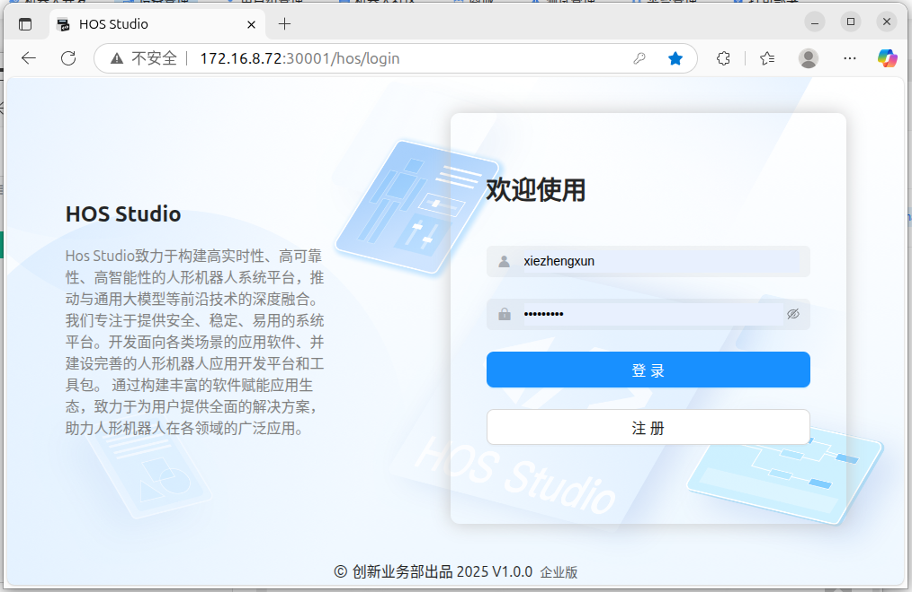
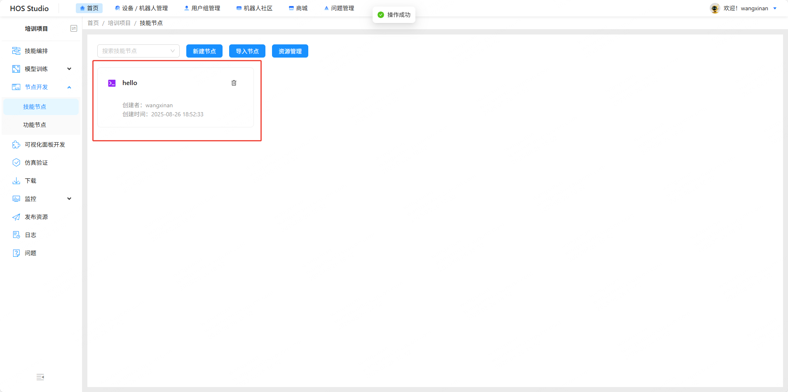

# HOS Studio

## 什么是HOS Studio？
HOS（Humanoid Operating System） Studio是助力人形机器人开发的一站式开发云平台，基于DevOps理念涵盖模型训练、技能开发、仿真测试、缺陷管理、实机部署、监控运维、生态社区等全流程功能

### 能带来什么好处？
- 开箱即用的开发环境
- 支持企业级多人协作
- 开发成果模块化复用
- 完全内置的版本管理
- 插件系统及开发环境
- DevOps CI/CD
- 开放共建的生态社区

### 登录
可新注册用户，登录HOS平台


### 检查设备
进入“设备/机器人管理”页面，选择“真实设备”，点击右侧“刷新设备列表”按钮，查看待控制的机器人控制器是否在线


### 新建机器人及SDK
选择“机器人开发”，点击右侧“添加机器人”，填入信息

### 新建项目
1. 回到首页，点击新建项目，填写基本信息后，选择上一步新建的机器人和SDK，
2. 选择项目要绑定的设备，绑定之后该项目内的技能开发环境会直接在此设备内运行，
3. 选择项目要绑定的设备，绑定之后该项目内的技能开发环境会直接在此设备内运行，
4. 可以直接导入项目资源

### 技能编排
打开项目后默认进入技能编排页面，左侧节点栏会自动生成内置节点：

直接拖拽相应节点到画布上部署后即可直接使用（具体用法参见技能编排）：


### 新建技能
现在我们来新建一个技能，订阅一个/chatter话题，数据类型为std_msgs/String，接收到消息后打印。
点击左侧功能栏节点开发->技能节点，点击“新建技能节点”按钮，输入名称和描述后等待技能创建完成：

点击技能卡片进入技能开发环境，编写代码：
```
cd src && catkin_create_pkg helloworld rospy
touch helloworld/src/sub.py
```
编辑sub.py文件：

### 使用新技能
为方便调试，在浏览器上新开一个tab页，复制当前tab页地址，在新的HOS平台网页中进入技能编排页面，左侧节点栏会出现刚才新建的技能对应的节点：