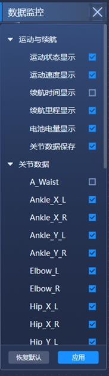

# 单机大屏软件使用手册

## 基本介绍
领航者机器人大屏显示软件基于WEB技术开发，兼容全平台操作系统，包括但不限于Windows、Mac、IOS、IpadOS、Android、Linux系统等，使用者无需准备特定平台终端。

## 登入界面
打开终端浏览器，输入”机器人ip:8085”，即可打开机器人控制界面，机器人的IP地址一般贴于机器人躯干上，开发测试所使用浏览器是chrome，可优先选用；
如果机器人连接成功，会弹出如下界面：

## 主界面元素介绍
  - 界面左上角“展厅实时画面”，显示机器人头部摄像头所拍摄到的实时视频流
  - 界面正上方“运动状态”栏，展示当前机器人的运动状态，该区域显示的信息内容可通过右下角设置菜单进行设置，目前可设置项目包括：运动状态，运行时间，运动速度，行进里程等项目；
  - 画面正中间区域显示机器人正在执行的任务情况：包括当前机器人所在区域的地图，机器人的实时定位（橙色点），和机器人执行任务的路线和点位等信息；
  - 界面正下方，展示了当前机器人全身的关节的pos信息，单位是rad；需要展示的关节数据可以通过有下面设置菜单进行勾选；
  - 界面右侧是个机器人的三维孪生模型，能根据机器人当前的关节状态实时显示机器人的姿势；
  - 机器人的左上方显示了机器人当前剩余电量信息，也可通过设置按键设置是否显示；
  - 界面的右下侧是设置按键，点击弹出主界面的可选显示元素的配置界面

## 设置按键数据监控项目设置
点击右下设置按键，弹出如下数据监控设置项目菜单：
用户可根据显示需求勾选需要在主界面显示的元素，选择完成后，点击“应用”按键，设置方能生效；点击“恢复默认”则将放弃自定义显示设置；

